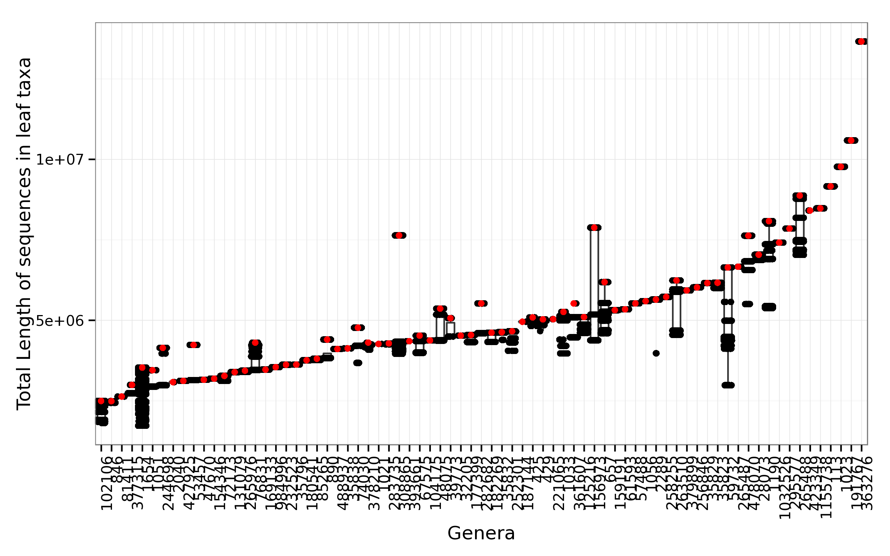

Selecting leaf taxa for genera without complete genomes.
====


```r
library(dplyr)
library(ggplot2)
theme_set(theme_bw())
```

## Introduction
For genera without leaf taxa (with completed genome), 
we select a viable leaf taxon based on (1) availability of of WGS records and (2) its total sequence length.

## Exploratory analysis

For each genus belongs numerous leaf taxa. 
We investigate:
1. total number of sequences (within the genus), 
2. the number of taxa within the genus
3. the combined sequence lengths


```r
data=read.table("./out/readSim.0101.output.txt",sep="\t", h=T)
str(data)
```

```
## 'data.frame':	25344 obs. of  5 variables:
##  $ taxid         : int  114 114 114 883151 883151 883151 883151 883151 883151 883151 ...
##  $ genus         : int  113 113 113 76831 76831 76831 76831 76831 76831 76831 ...
##  $ gi            : int  310975146 636558655 645322082 514961276 514961648 514961913 514961920 514961924 514961925 514961929 ...
##  $ refseq        : Factor w/ 25344 levels "NC_002806.1",..: 128 421 548 24080 24081 24082 24083 24084 24085 24086 ...
##  $ combinedLength: int  4428 4428 4428 4040949 4040949 4040949 4040949 4040949 4040949 4040949 ...
```

```r
#Exploratory analysis for the distribution of taxa within a given genus with relation to its total sequence length, number of sequences etc.
d2=data         %>% 
group_by(genus) %>%
summarise(numSeq=n(),
          numtaxa=length(unique(taxid)), 
          totLength=sum(as.numeric(combinedLength))) %>%
mutate(ratio = numSeq/numtaxa)
numGenus = length(unique(data$genus))
numTaxa  = length(unique(data$taxid))
```

A total of 80 genera were without completed completed genomes. 
A total of 640 leaf taxa under the former.


```r
ggplot(d2, aes(y=numSeq, x=numtaxa))+
geom_point(aes(size=sqrt(totLength)))+
geom_text(data=subset(d2, numSeq > 20000| numtaxa >=50 ), aes(label=genus), color='red')+
xlab("# taxa")+ylab("# sequences")
```

 <center><p class="caption"><b>Figure:</b> Number of fastA sequences within a genus against the number of taxa within a the same genus. Annotated genus are based on the following: > 20000 sequences or >50 taxa</p></center>

## Data Processing

We choose the taxa based on the availability of WGS data and total sequence length.

```r
#Will have to write the script which produces this wgstaxa, taken from NCBI

#read in wgs annotation list
wgs = setNames(read.table("~/db/refseq/wgstaxa",h=F), c("taxa"))
wgsdata = subset(data, taxid %in% wgs$taxa)

#choose max length taxa
chosen = wgsdata %>% 
group_by(genus) %>% 
filter(combinedLength == max(combinedLength))
str(chosen)
```

```
## Classes 'grouped_df', 'tbl_df', 'tbl' and 'data.frame':	7861 obs. of  5 variables:
##  $ taxid         : int  485913 485913 485913 485913 485913 485913 485913 485913 485913 485913 ...
##  $ genus         : int  363276 363276 363276 363276 363276 363276 363276 363276 363276 363276 ...
##  $ gi            : int  343201746 298240972 298244067 298246545 298248889 298251200 298252301 298252372 298252405 298252427 ...
##  $ refseq        : Factor w/ 25344 levels "NC_002806.1",..: 181 3252 3253 3254 3255 3256 3257 3258 3259 3260 ...
##  $ combinedLength: int  13662972 13662972 13662972 13662972 13662972 13662972 13662972 13662972 13662972 13662972 ...
##  - attr(*, "vars")=List of 1
##   ..$ : symbol genus
```

### WGS availability 

404 taxa were removed because they have no WGS projects listed in NCBI, this resulted in 516 sequences trimmed out of a total of 25344.


```r
ggplot() + 
geom_boxplot(data=wgsdata, aes(x=reorder(as.factor(genus), combinedLength, median), y=combinedLength))+
geom_jitter( data=wgsdata, aes(x=reorder(as.factor(genus), combinedLength, median), y=combinedLength))+
geom_point(data=subset(wgsdata, taxid %in% chosen$taxid), aes(x=as.factor(genus), y=combinedLength),color='red')+
theme(axis.text.x = element_text(angle=90, hjust=1))+
xlab("Genera")+ylab("Total Length of sequences in leaf taxa")
```

 <center><p class="caption"><b>Figure:</b>We plot the concatenated lengths of the sequences and across genera. Each data point represents one leaf taxa. Highlighted in red are the selected taxa.</p></center>


```r
write.table(chosen %>% select(-gi), file="out/readSim.0102.chosen_scaffolds.txt", sep="\t", quote=F, row.names=F, 
col.names=c("taxid","parentID","Chromosome.RefSeq", "totalLength"))
```


```r
sessionInfo()
```

```
## R version 3.1.1 (2014-07-10)
## Platform: x86_64-unknown-linux-gnu (64-bit)
## 
## locale:
##  [1] LC_CTYPE=en_US.UTF-8       LC_NUMERIC=C              
##  [3] LC_TIME=en_US.UTF-8        LC_COLLATE=en_US.UTF-8    
##  [5] LC_MONETARY=en_US.UTF-8    LC_MESSAGES=en_US.UTF-8   
##  [7] LC_PAPER=en_US.UTF-8       LC_NAME=C                 
##  [9] LC_ADDRESS=C               LC_TELEPHONE=C            
## [11] LC_MEASUREMENT=en_US.UTF-8 LC_IDENTIFICATION=C       
## 
## attached base packages:
## [1] stats     graphics  grDevices utils     datasets  methods   base     
## 
## other attached packages:
## [1] ggplot2_1.0.0.99 dplyr_0.3.0.2    knitr_1.8        vimcom_1.0-6    
## [5] setwidth_1.0-3   colorout_1.0-3  
## 
## loaded via a namespace (and not attached):
##  [1] assertthat_0.1   colorspace_1.2-4 DBI_0.3.1        digest_0.6.8    
##  [5] evaluate_0.5.5   formatR_1.0      grid_3.1.1       gtable_0.1.2    
##  [9] labeling_0.3     lazyeval_0.1.10  magrittr_1.5     MASS_7.3-35     
## [13] munsell_0.4.2    parallel_3.1.1   plyr_1.8.1       proto_0.3-10    
## [17] Rcpp_0.11.3      reshape2_1.4.1   scales_0.2.4     stringr_0.6.2   
## [21] tools_3.1.1
```
