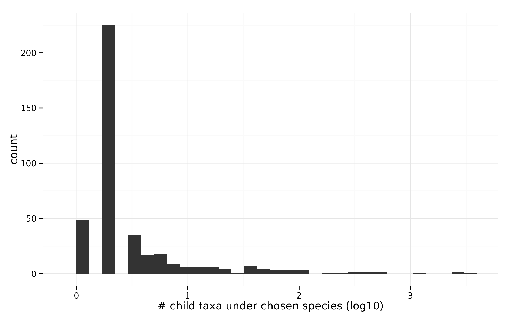

Trimming the database
====

## Sypnosis
For each of the taxa chosen (with and without completed genomes), we 
identity the corresponding species it belongs to. We proceed by removing all
species belonging under these species from the NR database


```r
library(MetamapsDB)
library(dplyr)
library(ggplot2)
library(RJSONIO)
theme_set(theme_bw())
config = fromJSON("config.json")
```

## Part1

Finding the species ID of chosen leaf taxa.


```r
chosen_genomes      = read.table("out/readSim.0100.chosen_completeGenomes",h=T, sep="\t", quote="")
chosen_nogenomes    = read.table("out/readSim.0102.chosen_scaffolds.txt",h=T, sep="\t", quote="")
#Request for species name of the chosen taxa
query = 
"START 
   basetaxa=node:ncbitaxid(taxid={taxaid}) 
MATCH 
   basetaxa-[:childof*0..]->(higher:species)-[:childof*0..]->(highest:genus)
RETURN 
   basetaxa.taxid as taxid, 
   higher.taxid as species, 
   highest.taxid as genus, 
   head(labels(higher)) as rankSpecies, 
   head(labels(highest)) as rankGenus"

##Part1::From the complete genome list 
completeGenomeSelectedSpecies = do.call(rbind,
        lapply(as.character(unique(chosen_genomes$taxid)), function(x){
               dbquery(query,list(taxaid=x),cypherurl=config$cypherurl)
        })      )

##Part2::From the incomplete genome list 
incompleteGenomeSelectedSpecies  = 
do.call(rbind,
        lapply(as.character(unique(chosen_nogenomes$taxid)), function(x){
               dbquery(query,list(taxaid=x),cypherurl=config$cypherurl)
        })      )

selectedSpecies = rbind(completeGenomeSelectedSpecies, incompleteGenomeSelectedSpecies)
```

In the complete genome set a total of 333 were identitfied 
whereas for the incomplete genome list 75 were found. For a total of 
408 species.

## Part 2
Using neo4j, we query for the tax IDs of all taxa falling under the identitified species.


```r
query = 
"start
species = node:ncbitaxid(taxid={taxaid}) 
match 
p = (species)<-[:childof*0..]-(lowest)
return
species.taxid as species, 
lowest.taxid as underling, 
head(labels(lowest)) as rank"

lotr = 
do.call(rbind,
        lapply(as.character(unique(selectedSpecies$species)), function(x){
               dbquery(query,list(taxaid=as.character(x)), cypherurl=config$cypherurl)
        })      )
selected2 = merge(selectedSpecies[, c("species", "genus")], lotr, by="species",all=T)
selected2 =as.data.frame(t(apply(selected2,1,unlist)))	#problematic df structure
selected3 = selected2 %>%
group_by(genus) %>%
summarise(speciesCount = length(unique(species)), underlingCount = length(unique(underling)))
```

We found a total of 14749 taxa to remove.


```r
ggplot(selected3, aes(log10(underlingCount)))+
geom_histogram()+
xlab("# child taxa under chosen species (log10)")
```

```
## stat_bin: binwidth defaulted to range/30. Use 'binwidth = x' to adjust this.
```

 <center><p class="caption"><b>Figure</b> SpeciesCount vs underlingCount</p></center>


```r
#Writes to file
write.table(selected2, "out/readSim.0201.output.txt",row.names=F, quote=F,sep="\t")
```


```r
sessionInfo()
```

```
## R version 3.1.1 (2014-07-10)
## Platform: x86_64-unknown-linux-gnu (64-bit)
## 
## locale:
##  [1] LC_CTYPE=en_US.UTF-8       LC_NUMERIC=C              
##  [3] LC_TIME=en_US.UTF-8        LC_COLLATE=en_US.UTF-8    
##  [5] LC_MONETARY=en_US.UTF-8    LC_MESSAGES=en_US.UTF-8   
##  [7] LC_PAPER=en_US.UTF-8       LC_NAME=C                 
##  [9] LC_ADDRESS=C               LC_TELEPHONE=C            
## [11] LC_MEASUREMENT=en_US.UTF-8 LC_IDENTIFICATION=C       
## 
## attached base packages:
## [1] stats     graphics  grDevices utils     datasets  methods   base     
## 
## other attached packages:
## [1] RJSONIO_1.3-0    ggplot2_1.0.0.99 dplyr_0.3.0.2    MetamapsDB_0.01 
## [5] knitr_1.8       
## 
## loaded via a namespace (and not attached):
##  [1] assertthat_0.1   bitops_1.0-6     colorspace_1.2-4 DBI_0.3.1       
##  [5] digest_0.6.8     evaluate_0.5.5   formatR_1.0      grid_3.1.1      
##  [9] gtable_0.1.2     igraph_0.7.1     labeling_0.3     lazyeval_0.1.10 
## [13] magrittr_1.5     MASS_7.3-35      munsell_0.4.2    parallel_3.1.1  
## [17] plyr_1.8.1       proto_0.3-10     Rcpp_0.11.3      RCurl_1.95-4.5  
## [21] reshape2_1.4.1   scales_0.2.4     stringr_0.6.2    tools_3.1.1
```
