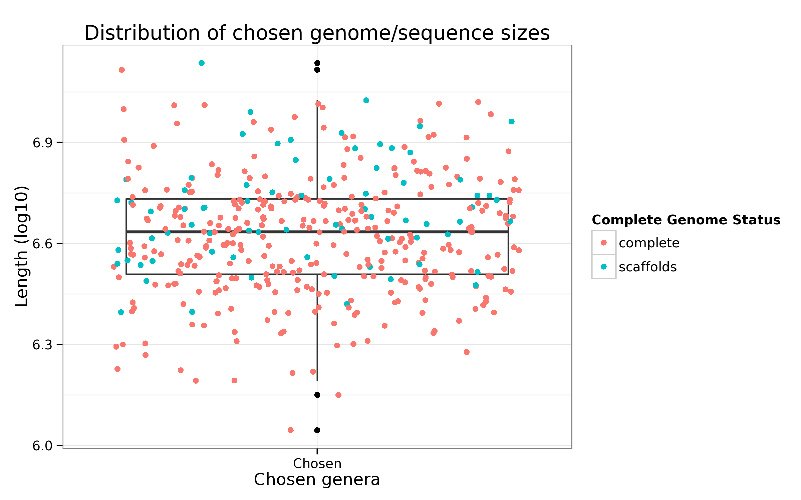

Total nucleotide length of selected leaf taxa
====

## Sypnosis

We investigate the total length, in base pairs, representing each of the leaf taxa which in turn represent the given genera.


```r
#Reads in appropriate tables
data            <- read.table("out/readSim.0301.lengthtable.txt", h=T, sep="\t")
completeGenomes <- read.table("out/readSim.0100.chosen_completeGenomes",sep="\t",h=T)$parentID
data$genome = 'scaffolds'
data$genome[data$genus %in% completeGenomes] = 'complete'
str(data)
```

```
## 'data.frame':	407 obs. of  3 variables:
##  $ genus : int  724 83612 914 127 52959 1016 1033 2053 1298 963 ...
##  $ length: int  1981535 4321832 2661057 5472964 2961474 2612925 5261968 5669805 2467205 5513887 ...
##  $ genome: chr  "complete" "complete" "complete" "complete" ...
```


```r
ggplot(data, aes(x=as.factor('Chosen'), y=log10(length)))+
    geom_boxplot()+
    geom_jitter(aes(color=as.factor(genome)))+
    ylab("Length (log10)")+xlab("Chosen genera")+
    ggtitle("Distribution of chosen genome/sequence sizes")+
    scale_color_discrete(name="Complete Genome Status")
```

 <center><p class="caption"><b>Figure: </b>Total Combined sequence length of genus in log10 scale are given partitioned by availability of genomes</p></center>


```r
write.csv(data, file="out/readSim.0301.out.csv")
```


```r
sessionInfo()
```

```
## R version 3.1.1 (2014-07-10)
## Platform: x86_64-unknown-linux-gnu (64-bit)
## 
## locale:
##  [1] LC_CTYPE=en_US.UTF-8       LC_NUMERIC=C              
##  [3] LC_TIME=en_US.UTF-8        LC_COLLATE=en_US.UTF-8    
##  [5] LC_MONETARY=en_US.UTF-8    LC_MESSAGES=en_US.UTF-8   
##  [7] LC_PAPER=en_US.UTF-8       LC_NAME=C                 
##  [9] LC_ADDRESS=C               LC_TELEPHONE=C            
## [11] LC_MEASUREMENT=en_US.UTF-8 LC_IDENTIFICATION=C       
## 
## attached base packages:
## [1] stats     graphics  grDevices utils     datasets  methods   base     
## 
## other attached packages:
## [1] MetamapsDB_0.01  ggplot2_1.0.0.99 knitr_1.8       
## 
## loaded via a namespace (and not attached):
##  [1] bitops_1.0-6     colorspace_1.2-4 digest_0.6.8     evaluate_0.5.5  
##  [5] formatR_1.0      grid_3.1.1       gtable_0.1.2     igraph_0.7.1    
##  [9] labeling_0.3     MASS_7.3-35      munsell_0.4.2    plyr_1.8.1      
## [13] proto_0.3-10     Rcpp_0.11.3      RCurl_1.95-4.5   reshape2_1.4.1  
## [17] RJSONIO_1.3-0    scales_0.2.4     stringr_0.6.2    tools_3.1.1
```
